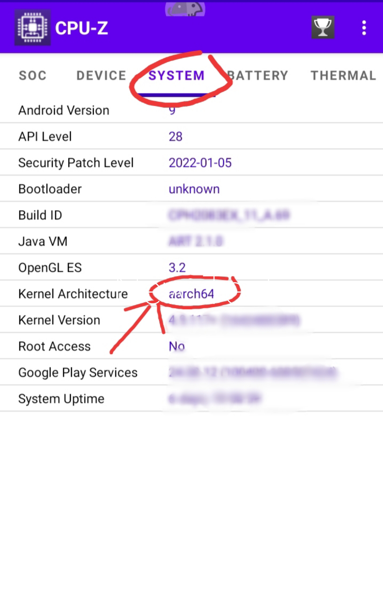

# Termux-ApkTool
> [!NOTE]
>❗❗repositori dalam script ini di ambil dari: ```https://github.com/rendiix/termux-apktool.git```
# instalasi
* ketikan perintah
```bash
pkg update && pkg upgrade
pkg install git
git clone https://github.com/YtGandroid/Termux-ApkTool
```

* kalo udah terus cek dulu apakah udah di install beneran apa belum
```bash
ls
```

+ kalo udah terus masuk ke diractorinya
```bash
cd Termux-ApkTool
```

+ sebelum milih file yang mau di buka cek dulu Kernel Architecture pake aplikasi [CPU Z] atau yang lain!!

+ Semisal ternyata Kernel nya ```aarch64``` maka ketik 
```bash
sh install.sh
dpkg -i apktool_2.7.1-SNAPSHOT_aarch64.deb
```
maka script suskes di install :+1:
# Menjalankan Script
## *Decompile
```bash
apktool d nama_apk.apk
```
+ jika kalian masih di layar home, (layar awal termux) maka harus menyertakan lokasi file nya contoh ```apktool d ~/storage/downloads/mana_apk.apk```

## *Recompile
+ Recompile dapat di lakukan dengan mengetikan
```bash
apktool b file_hasil_decompile -o mana_apk.apk --use-aapt2
```
sama seperti decompile, jika masih di layar home maka cantumkan lokasi filenya

## *Tandatangani
> + sayangnya untuk menandatangani ga cukup pake script Termux-ApkTool ini tapi kalian bisa menggunakan package ```apksigner``` dengan perintah
```bash
pkg install apksigner
apksigner -p pasword_keystore nama_baru_apk
```
